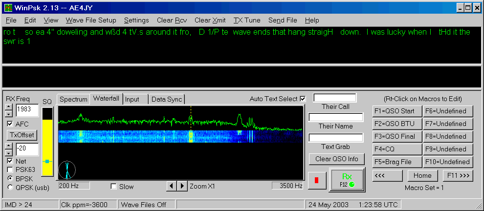

# WinPSK

WinPSK is PSK31 Software by Moe Wheatley, AE4JY

* WinPSK Website: https://www.moetronix.com/ae4jy/winpsk.htm

* WinPSK User Guide: [winpsk-user-guide-2.11.pdf](doc/winpsk-user-guide-2.11.pdf)

* PSKCore.DLL Software Specification: [pskcore-dll-spec.pdf](doc/pskcore-dll-spec.pdf)

PSK31 is an amateur radio communications mode introduced by Peter Martinez, G3PLX, that uses phase modulation and special character coding. It allows robust narrow bandwidth keyboard "Chat" type communications between two or more stations.

A DLL(Dynamic Link Library) was developed that can be used for receiving and transmitting PSK31 signals using a Windows soundcard. The DLL is a 32 bit Regular DLL written using Visual C++ and MFC. The user sends and receives data and status via calls to various routines exposed by the DLL. Custom User Windows messages are sent from the DLL to the application for notification of events that require action by the application program.
